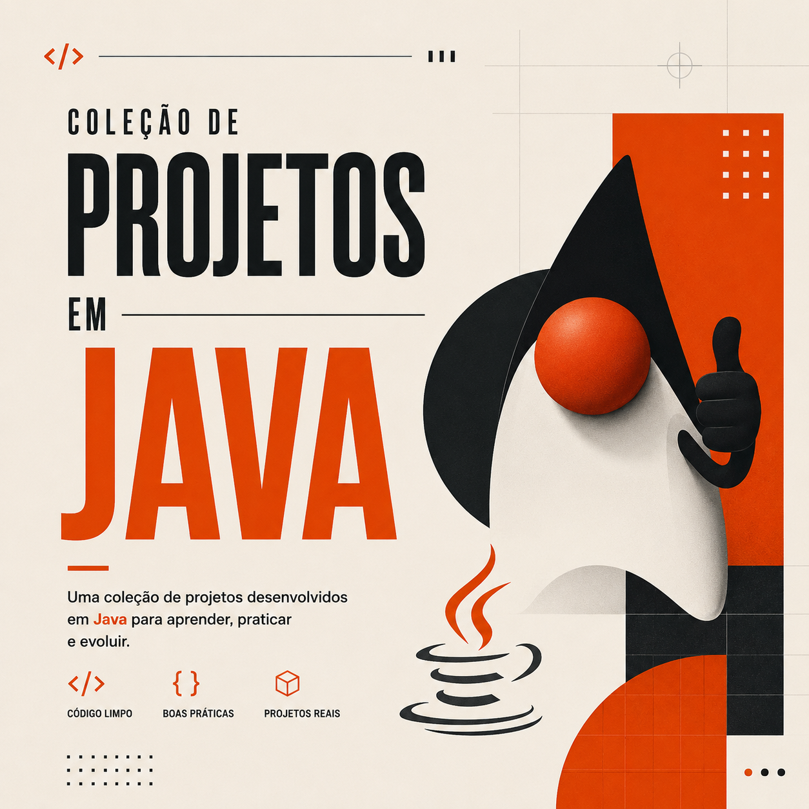
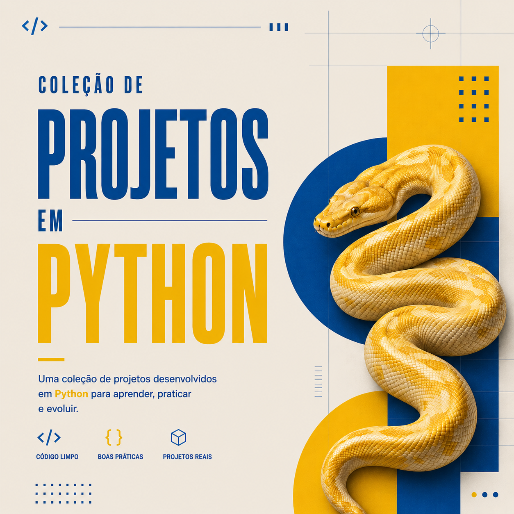
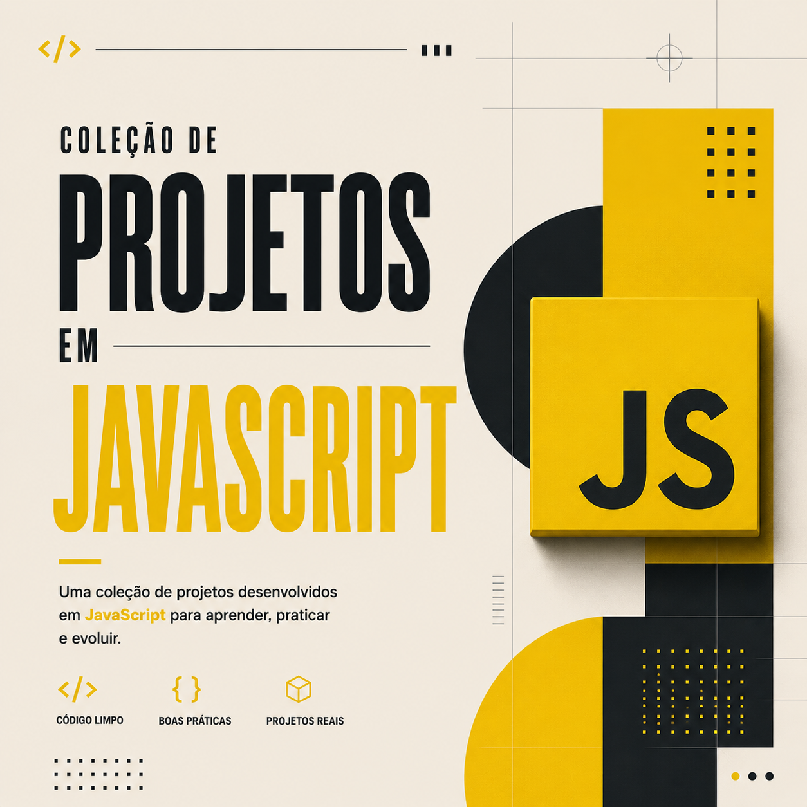
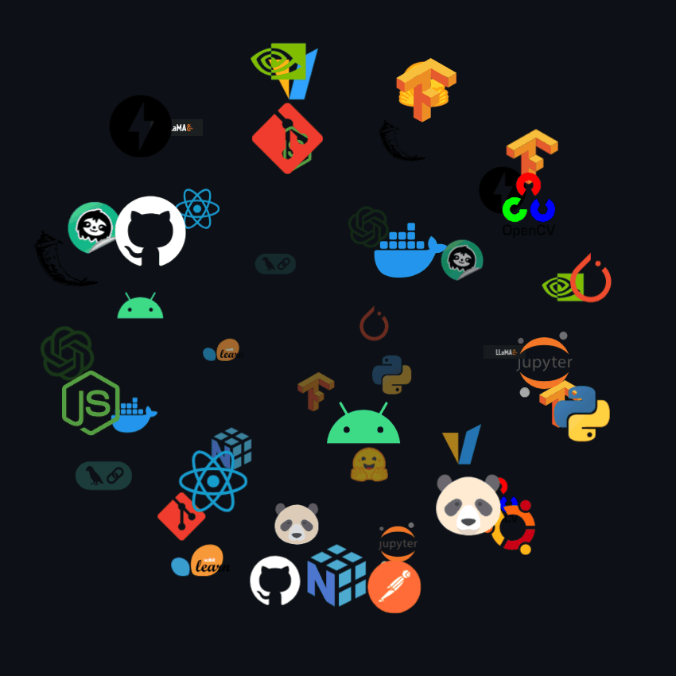

### Olá, eu sou Fernanda Andrade

  

Me chamo Fernanda Andrade, tenho 20 anos e curso Análise e Desenvolvimento de Sistemas.

Sou apaixonada por tecnologia, sempre buscando aprender e desenvolver soluções.

Aqui você encontrará projetos completos, documentações e experimentos voltados para IA, desenvolvimento web, chatbots e automações.

Compartilho meus projetos e dia a dia pelo [Instagram](https://www.instagram.com/_fernanda_dev).

  
  
  

---

### Projetos em Destaque

<table width="100%" cellspacing="12" cellpadding="12" style="width: 100%; table-layout: fixed;">
  <tr>
    <td valign="top" width="33.33%" align="center">
      
      
<a href="https://github.com/FernandaAndradedev-hash/java-projects.git">Ver repositório</a>

    </td>
    <td valign="top" width="33.33%" align="center">
      
      
<a href="https://github.com/FernandaAndradedev-hash/python-projects.git">Ver repositório</a>

    </td>
    <td valign="top" width="33.33%" align="center">
      
      
<a href="https://github.com/FernandaAndradedev-hash/javascript-projects.git">Ver repositório</a>

    </td>
  </tr>
</table>

---

### O que eu construo

| Área | Foco |
|---|---|
| **LLM & Sistemas Agentivos** | Desenvolvimento e orquestração de agentes inteligentes e workflows avançados utilizando Claude (Anthropic), ChatGPT (OpenAI) e Gemini. |
| **FrontEnd** | Criação de interfaces modernas, dinâmicas e reativas com HTML5, CSS3, JavaScript, TypeScript, React e Next.js. |
| **BackEnd** | Construção de APIs robustas, microsserviços e bancos de dados seguros com Python, Java, Node.js e MySQL. |
| **FullStack** | Desenvolvimento ponta a ponta com a stack completa (React/Next.js no front e Node/Python/Java no back), containerizado com Docker e versionado no Git. |
---

<h3 style="border-bottom: none; font-size: 2em; margin-bottom: 12px;">Tech Stack</h3>

<table width="100%">
  <tr> 
    <td valign="top" width="60%">
      
Linguagens

      

        
        
        
        
        
        
        
      

      
Tecnologias

      

        
        
        
        
        
        
      

      
LLMs / IA

      

        
        
        
      

    </td>
    <td valign="middle" align="center" width="40%">
      <picture>
        <source media="(prefers-color-scheme: dark)" srcset="imagens/gif-tecnologia.gif">
        <source media="(prefers-color-scheme: light)" srcset="imagens/gif-tecnologia.gif">
        
      </picture>
    </td>
  </tr>
</table>

---

### Estatísticas

  
  

 
